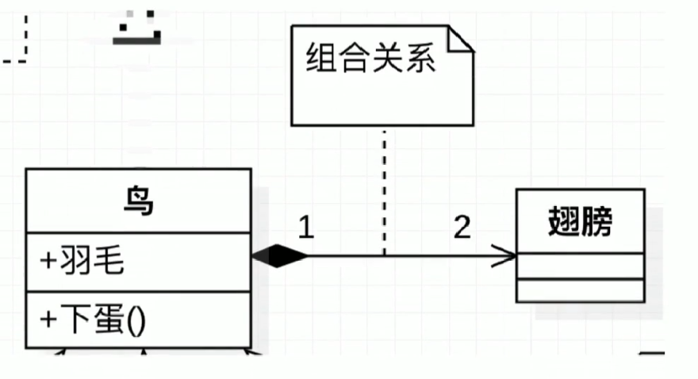

# UML入门

## UML定义

- 统一建模语言（英语：UnifiedModelingLanguage，缩写UML）
- 非专利的第三代建模和规约语言

## UML 特点

- UML是一种开放的方法
- 用于说明、可视化、构建和编写一个正在开发的面向对象的、软件密集系统的制品的开放方法
- UML展现了一系列最佳工程实践这些最佳实践在对大规模，复杂系统进行建模方面，特别是在软件架构层次已经被验证有效

## UML2.2分类

UML2.2中一共定义了14种图示，分类如下：

- 结构式图形：强调的是系统式的建模
- 行为式图形：强调系统模型中触发的事件
- 交互式图形：属于行为式图形子集合，强调系统模型中资料流程

## 结构式图形

- 静态图（类图，对象图，包图）
- 实现图（组件图，部署图）
- 剖面图
- 复合结构图

## 行为式图形

- 活动图
- 状态图
- 用例图

## 交互式图形

- 通信图
- 交互概述图（UML2.0）
- 时序图（UML2.0 ）
- 时间图（UML2.0）

## UML类图

- ClassDiagram:用于表示类、接口、实例等之间相互的静态关系
- 虽然名字叫类图，但类图中并不只有类

## 记忆技巧

### 记忆技巧-箭头方向

- UML箭头方向：从子类指向父类
    - 提示：可能会认为子类是以父类为基础的，箭头应从父类指向子类

1. 定义子类时需要通过extends关键字指定父类
2. 子类一定是知道父类定义的，但父类并不知道子类的定义
3. 只有知道对方信息时才能指向对方
4. 所以箭头方向是从子类指向父类

### 记忆技巧-实线-继承|虚线-实现

- 空心三角箭头：继承或实现
- 实线-继承，is a关系，扩展目的，不虚，很结实
- 虚线-实现，虚线代表”虚”无实体

### 记忆技巧-实线-关联|虚线-依赖

- 实线-关联关系：关系稳定，实打实的关系，铁哥们
- 表示一个类对象和另一个类对象有关联
- 通常是一个类中有另一个类对象做为属性

- 虚线-依赖关系：临时用一下，若即若离，虚无缥缈，若有若无
- 表示一种使用关系，一个类需要借助另一个类来实现功能
- 一般是一个类使用另一个类做为参数使用，或作为返回值

### 记忆技巧-空心菱形-聚合|实心菱形-组合

- 菱形就是一个盛东西的器Ⅲ（例如盘子）
- 聚合：代表空器血里可以放很多相同东西，聚在一起（箭头方向所指的类）
- 组合：代表满器皿里已经有实体结构的存在，生死与共

#### 记忆技巧-空心菱形-聚合

- 整体和局部的关系，两者有着独立的生命周期，是has a的关系
- 弱关系
- 消极的词：弱-空

#### 记忆技巧-实心菱形-组合

- 整体与局部的关系，和聚合的关系相比，关系更加强烈 两者有相同的生命周期，contains-a的关系
- 强关系
- 积极的词：强-满

**常见数字表达及含义，假设有A类和B类，数字标记在A类侧**

- `0..1`:0或1个实例.
- `0..*`:0或多个实例.
- `1..1`:1个实例.
- `1`：只能有一个实例
- `1..*`:至少有一个实例

## UML时序图

- SequenceDiagram：是显示对象之间交互的图，这些对象是按时间顺序排列的。
- 时序图中包括的建模元素主要有： 对象（Actor）、生命线（Lifeline）、控制焦点（Focus of control）、消息（Message）等

# UML类图

- 抽象类名用斜体，接口用尖括号<>表示
- 第二部分类的属性，第三部分类的行为
- `+` 最大访问权限
- `-` 最小访问权限
- `#` 受保护访问权限
- `~` 包访问权限
- ·_· 横向代表static属性/方法
- 行为当中斜体代表抽象方法

